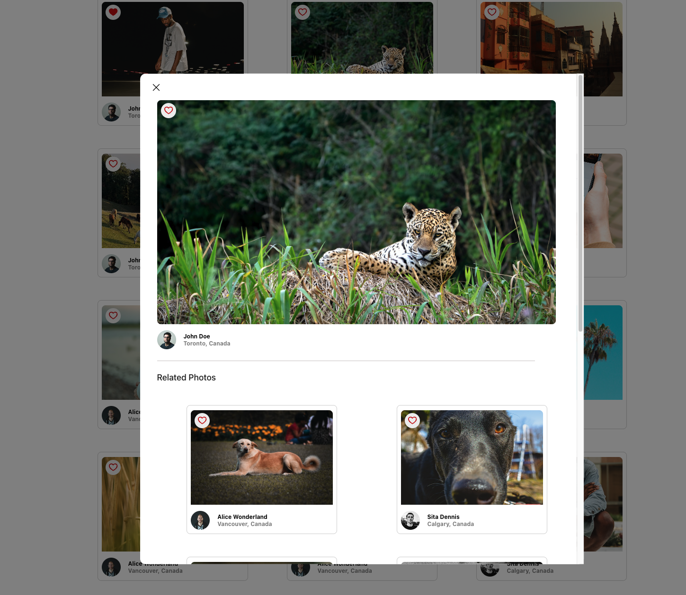
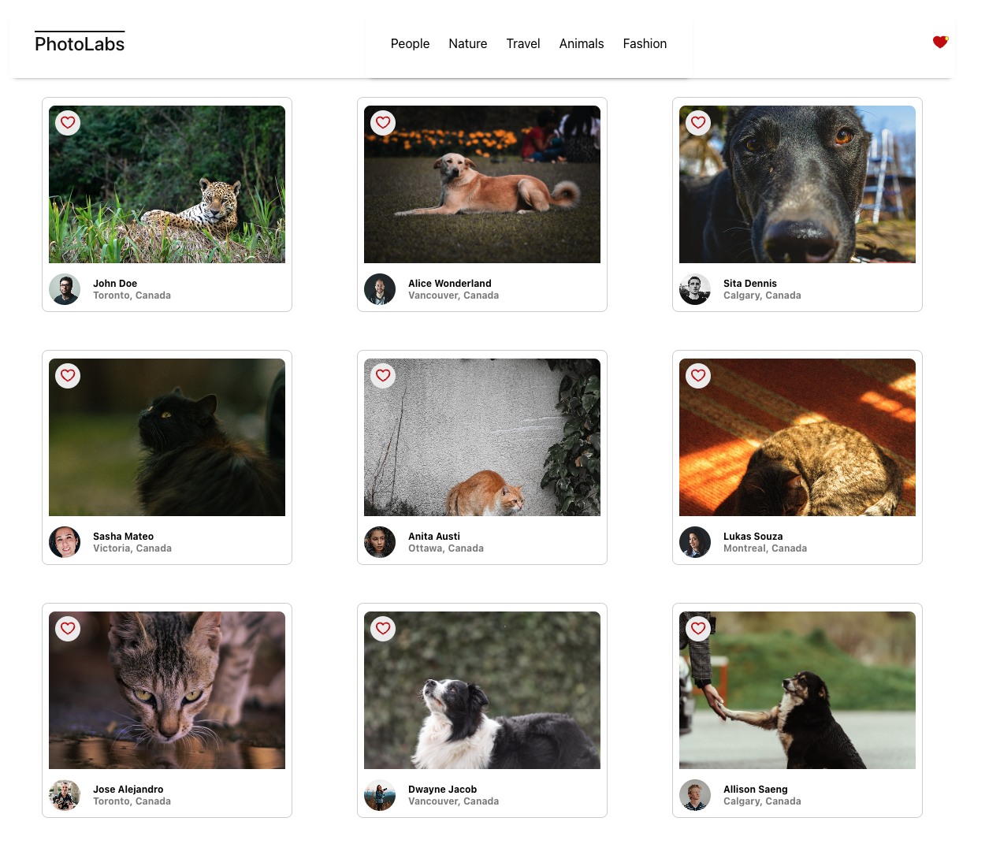

# 📸 PhotoLabs

React-based single-page client side application that allows users to view photos in different contexts.

## 🛠️ Tech Stack

<p align="center">
  <a href="https://skillicons.dev">
    
  </a>
</p>

- Frontend: `React`
- API server: `Node Express.js`
- Database: `PostgreSQL`

## 👤 User Stories

- A user can view photos from the homepage loaded from the API
- The user can navigate to different photo topics
- The user can click on a photo to view a larger version of the photo and relevant / similar photos
- The user can like a photo from anywhere within the application where the photo is displayed
- The user can view a heart icon with a notification in the navigation if there are liked photos
- The navigation will consist of different topics and heart icon
- The client-side application will make API requests to load and persist data (i.e. relevant data is not lost after a session restarts, so after a browser refresh)

## 📝 Technical Specifications

- Client application uses `Create React App (CRA) `
- Express is used for `API server application`
- Two different servers were used during development:
  - Client-side Webpack development server
  - API server to provide photo data
- Application's data layer consists of `PostgreSQL` database
- The client communicates with the API over HTTP using the JSON format

## 🏗️ Setup

Install dependencies with `npm install` in each respective `/frontend` and `/backend`.

## [Frontend] Running Webpack Development Server

```sh
cd frontend
npm start
```

## [Backend] Running Backend Servier

Read `backend/readme` for further setup details.

```sh
cd backend
npm start
```

# 💻 Demo

#### PhotoLabs Home Page


#### User can preview larger image of clicked photo in modal view.

#### The favourite photos still stays stored across application.

#### Modal also displays related / similar photos.



#### User can click on certain topic from navigation bar and filter the shown images. In the example below, 'Nature' photos are displayed


